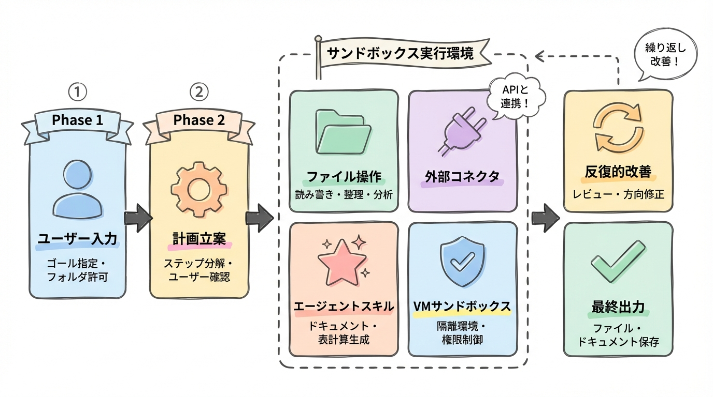
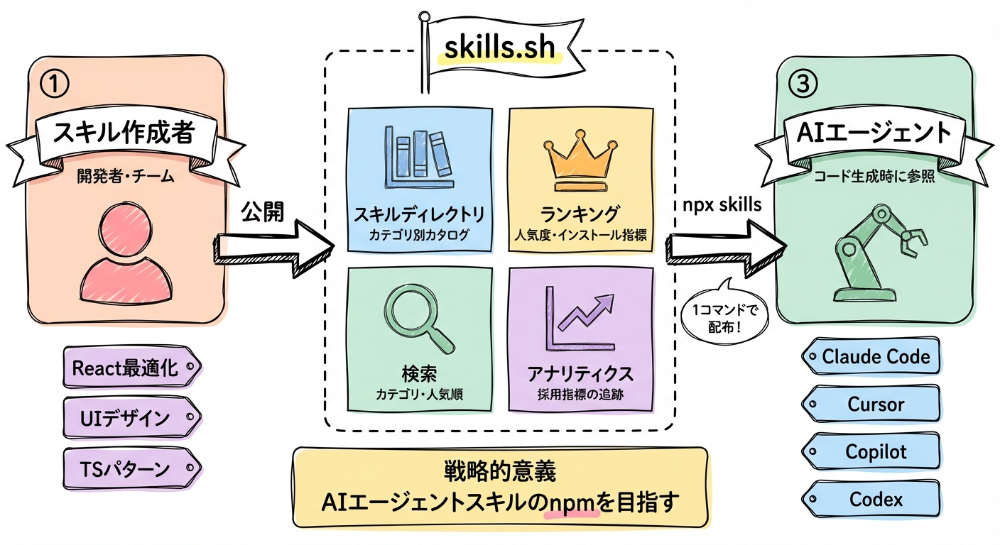
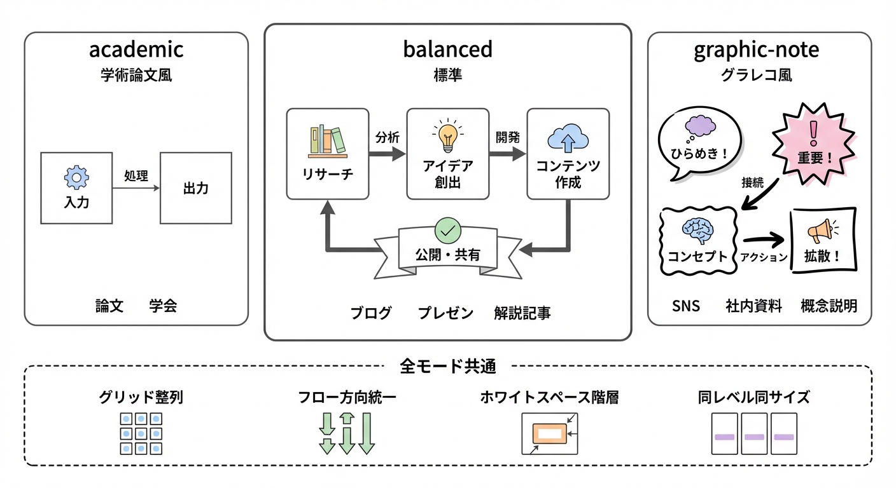
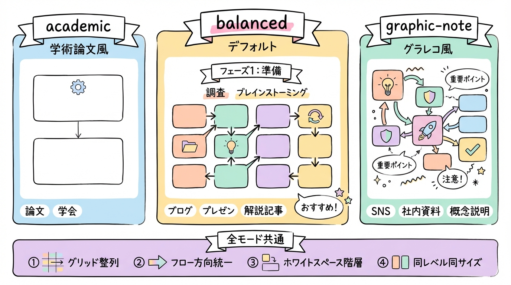
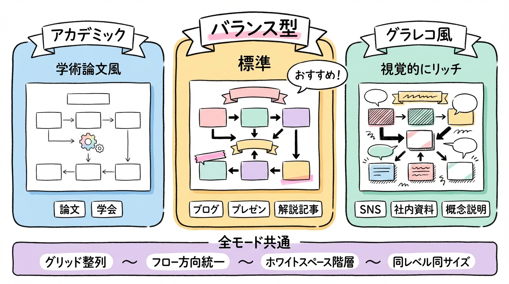
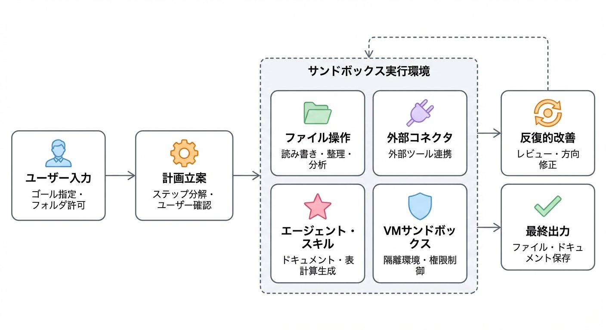
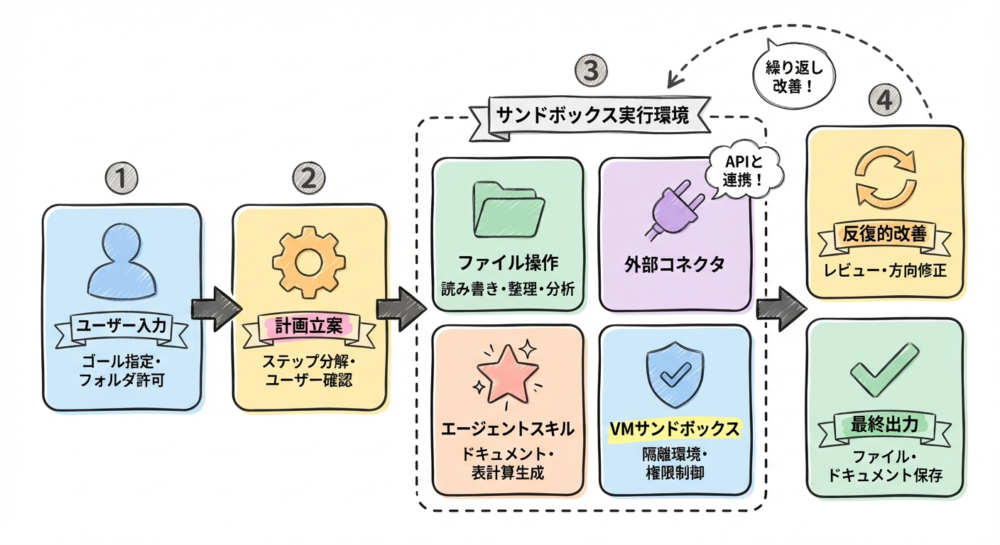
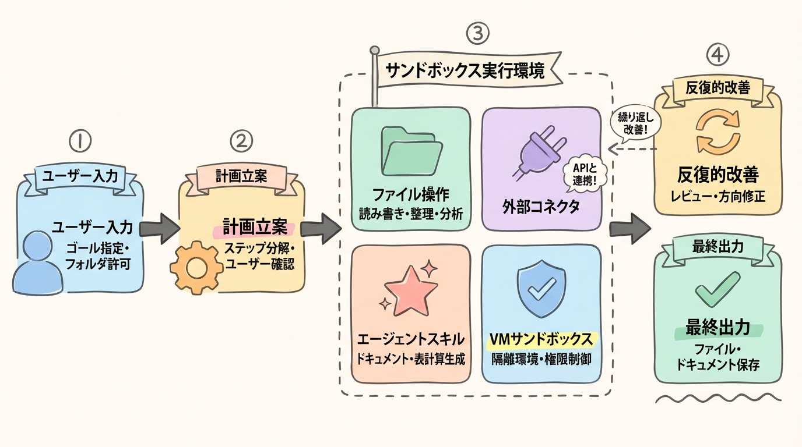
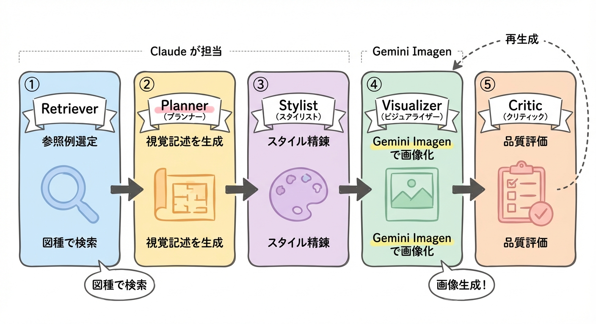

# generate-diagram-jp

[](LICENSE)
[](https://docs.anthropic.com/en/docs/claude-code)
[](https://aistudio.google.com/)
[](https://www.python.org/)
[](https://github.com/llmsresearch/paperbanana)

テキストから日本語図解を自動生成する Claude Code スキル。画像生成には Gemini Imagen を使用。

[PaperBanana](https://github.com/llmsresearch/paperbanana) の手法をベースに、Claude が Retriever → Planner → Stylist → Critic の全推論工程を担当し、Gemini Imagen が最終画像を生成するマルチステージパイプライン。

[English version](README_EN.md)

## 生成例

テキストを入力するだけで、内容に応じた図種（パイプライン、比較図、アーキテクチャ図など）を自動判定し図解を生成:

**AIエージェントパイプライン**（balanced モード）



**ヘルスケアAI戦略比較**（balanced モード）


**プラットフォームアーキテクチャ**（balanced モード）



> その他の作例は [Gallery](docs/GALLERY.md) を参照。

## スタイルモード

学術論文風からグラレコ風まで、3段階のスタイルを `--style` で切り替え可能。同じ「モード概要」の図をそれぞれのスタイルで描くとこうなる:

<table>
<tr>
<td align="center"><strong><code>academic</code></strong><br>学術論文風</td>
<td align="center"><strong><code>balanced</code></strong>（デフォルト）<br>グラレコ＋構造</td>
<td align="center"><strong><code>graphic-note</code></strong><br>グラレコ風</td>
</tr>
<tr>
<td></td>
<td></td>
<td></td>
</tr>
</table>

同じ入力テキストから各モードで生成した実物比較:

<table>
<tr>
<td align="center"><code>academic</code></td>
<td align="center"><code>balanced</code></td>
<td align="center"><code>graphic-note</code></td>
</tr>
<tr>
<td></td>
<td></td>
<td></td>
</tr>
</table>

全モード共通の空間構成ルール（グリッド整列、フロー方向統一、ホワイトスペース階層）の上に、モードごとに色使い・線のタッチ・装飾・アイコンスタイルが変わる。

## セットアップ

### 必要なもの

- [Claude Code](https://docs.anthropic.com/en/docs/claude-code) CLI
- Python 3.10+
- Gemini API キー（[こちらで取得](https://aistudio.google.com/apikey)）

### インストール

1. リポジトリをクローン:

```bash
git clone https://github.com/hanamitsu/generate-diagram-jp.git
cd generate-diagram-jp
```

2. Python依存パッケージをインストール:

```bash
pip install -r requirements.txt
```

3. APIキーを設定:

```bash
cp .env.example .env
# .env を編集して GEMINI_API_KEY を記入
```

4. Claude Code でプロジェクトを開く:

```bash
claude
```

## 使い方

```
/generate-diagram-jp input.txt "図のキャプション"
/generate-diagram-jp input.txt "図のキャプション" --style graphic-note
```

- 第1引数: 図解したい内容を記述したテキストファイルのパス
- 第2引数: 図のキャプション（省略時は Claude が質問する）
- `--style`: `academic` / `balanced`（デフォルト） / `graphic-note`

### 入力ファイルの書き方

テキストファイルに、図解したいコンセプト・システム・プロセスを日本語または英語で記述する:

```
このシステムは3層アーキテクチャを採用する。
第1層はユーザーインターフェース、第2層はビジネスロジック、
第3層はデータベースである。各層間はAPIで通信する。
```

Claude がテキストを分析し、最適な図種（パイプライン、比較図、アーキテクチャ図など）を判断。詳細な視覚記述を生成した上で、Gemini Imagen に渡して画像化する。

## 仕組み



1. **Retriever** — 図種・トピックの類似度で `data/reference_sets/` から参照例を選定
2. **Planner** — 入力テキストから図の詳細な視覚記述（レイアウト、コンポーネント、アイコン、色）を生成
3. **Stylist** — 選択モードのスタイルガイドに基づいて記述を精錬
4. **Visualizer** — `gemini_generate.py` 経由で Gemini Imagen に送信し画像生成
5. **Critic** — 生成画像を忠実性・読みやすさで評価。必要に応じて1回再生成

## プロジェクト構成

```
.claude/skills/generate-diagram-jp/
  SKILL.md              # パイプライン定義（スキル本体）
  style-guide.md        # 3モードのスタイルルール
  scripts/
    gemini_generate.py  # Gemini Imagen APIラッパー
data/
  guidelines/
    methodology_style_guide.md  # スタイルルール（英語版）
  reference_sets/
    index.json          # 参照例メタデータ
    images/             # 参照図画像（合計 約1.2MB）
```

## ライセンス

MIT License — [LICENSE](LICENSE) を参照。

本プロジェクトは [PaperBanana](https://github.com/llmsresearch/paperbanana)（MIT License, Copyright (c) 2025 PaperBanana Contributors）をベースに構築。
