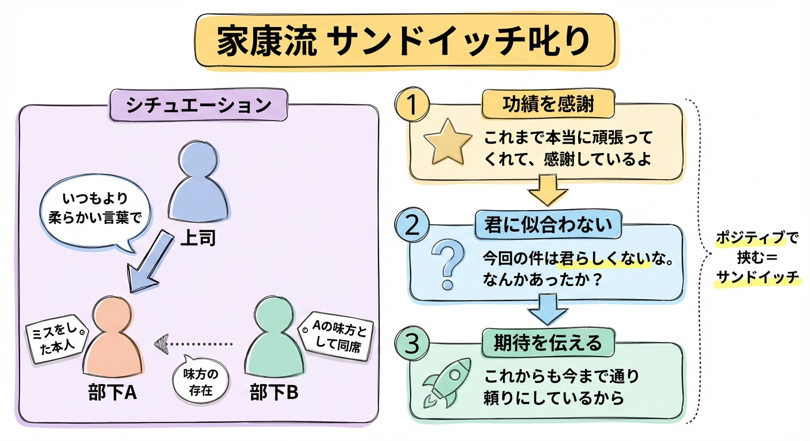
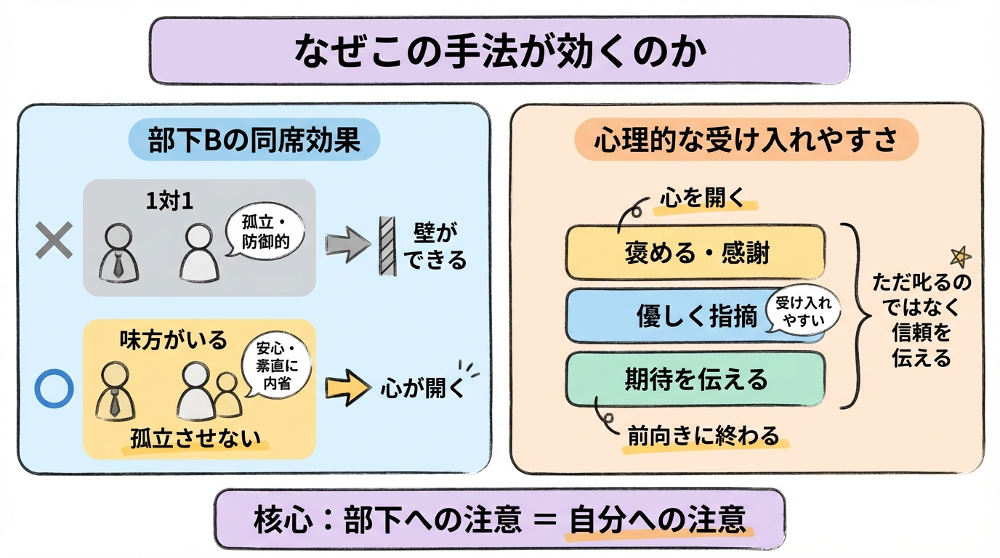

# 家康流「サンドイッチ叱り」

> 引用元: [@nana_ollife](https://x.com/nana_ollife/status/2025887610711765205)

## シチュエーション

上司が **部下A（ミスをした本人）** を叱りたいとき、部下Aと親しいもう1人（部下B）だけを呼ぶ。

部下Bは「味方」として同席させるだけで、基本的に上司から直接話しかけられるわけではない。

## 上司が部下二人（特に部下A）に対してする話の流れ

上司はいつもより明らかに柔らかい言葉で、以下の順番で話す。

### 1. まずはこれまでの功績を感謝する

「これまで○○のところで本当に頑張ってくれて、感謝しているよ」など、具体的に褒めて認める。

### 2. 次に「今回のミスは君に似合わない」と伝える

「ただ、今回の件は君らしくないな。なんかあったか？」

責める言い方ではなく、**「君らしくない」** というニュアンスで伝える。

### 3. 最後に「これまで通りの活躍を期待している」と言う

「これからも今まで通り頼りにしているから、引き続き頑張ってくれ」

## ポイント

- **部下Bを呼ぶ理由**：部下Aを孤立させないため。「味方が横にいる」状態だと、人は防御的にならず素直に内省しやすくなる（これが家康流の賢いところ）
- **サンドイッチ叱り**：「ただ叱る」のではなく、褒めて → 優しく指摘して → また期待を伝えて締める、という心理的に受け入れやすい構造。親しい部下Bを同席させることでさらに効果を高める
- **「部下への注意 ＝ 自分への注意」** と上司自身が心得る
