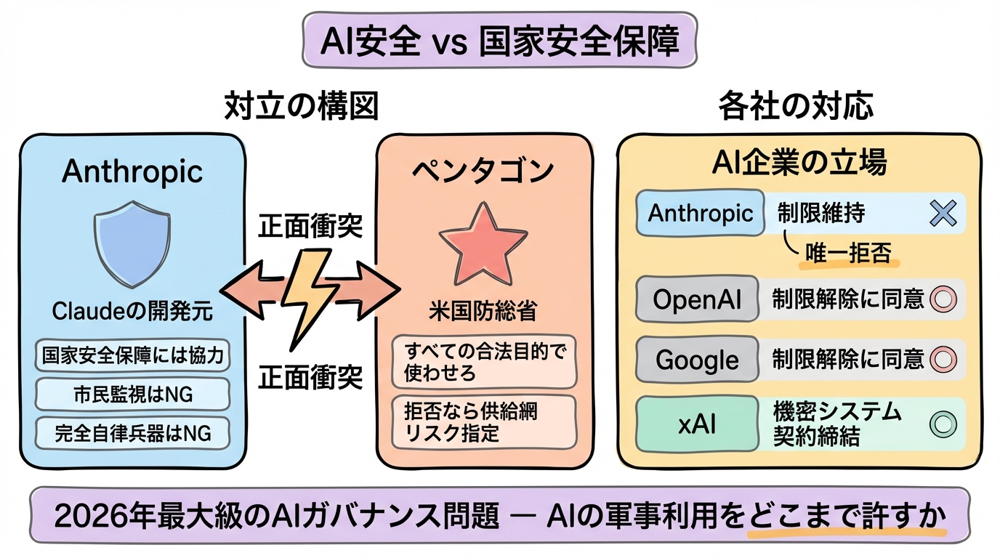
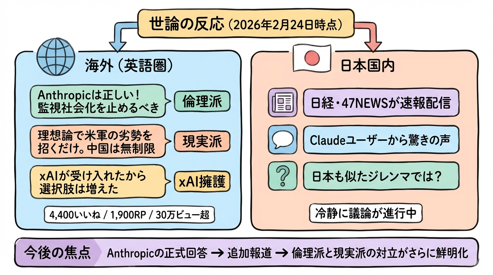

# Anthropic vs ペンタゴン ― AI安全と国家安全保障の正面衝突

## 何が起きているか

米国防総省（ペンタゴン）が、AI企業Anthropic（Claudeの開発元）に対し「軍事利用の安全制限を全部外せ」と強く要求している問題。

国防長官のPete Hegseth氏が2月23日（現地時間）、Anthropic CEOのDario Amodei氏をペンタゴンに呼び出した。

- **要求内容**: Claudeを「すべての合法的な目的」で使えるようにする（＝SNS大規模監視、投票者データ解析、市民の銃所持・デモ履歴のAI監視、自律型兵器開発など）
- **拒否した場合**: Anthropicを「供給網リスク（Supply Chain Risk）」に指定（＝Huawei並みの事実上の締め出し）。防衛関連企業はClaudeを使えなくなり、事業に大打撃

## 背景

- Claudeは現在、米軍の機密ネットワーク内で唯一使える最先端AI（すでに1月のマドゥロ作戦で実戦使用済み）
- Anthropicは「国家安全保障には協力するが、**市民監視と完全自律兵器はNG**」という線引きを守っている
- 一方、OpenAI・Google・xAIは制限解除に同意済み（xAIは新たに機密システム利用の契約締結）

## 本質

**「AIの安全・倫理を守る民間企業」 vs 「軍事優位（特に中国に対抗）を最優先する政府」** の初の正面衝突。

「自社AIが危険だと認めている会社が、なぜ軍に無制限で渡さないのか？」という政府側の苛立ちと、「政府が民間企業に安全制限の解除を強制するのはおかしい」というAnthropic側の主張がぶつかっている。

要するに **「AIの軍事利用をどこまで許すか」** という、2026年最大級のAIガバナンス問題。

## X（SNS）の動向（2026年2月24日午前時点）

### 海外（英語圏中心）

- 元投稿（@shanaka86）が爆発的に拡散中：約4,400いいね、1,900リポスト、30万ビュー超
- **倫理派**: 「Anthropicは正しい！政府の監視社会化を止めるべき」
- **現実派**: 「理想論で米軍の劣勢を招くだけ。中国は無制限に進めてるぞ」
- **xAI擁護**: 「xAI/Grokが制限なしで合意したから米軍の選択肢が増えた」

### 日本国内

- 日経新聞・47NEWSが速報配信
- Claudeユーザー（日本に多い）から「うちのAIのボスが呼び出された…」という驚きの声
- 「日本も似たようなジレンマを抱えているのでは？」という指摘
- まだ「騒動」というより「重要ニュース」として冷静に議論されている

## 総括

まだ事件発生から1日程度。今後Anthropic側の正式回答や追加報道でさらに動きそう。

**「AI安全 vs 国家安全保障」の世界的な分水嶺** になる可能性が高く、Xでは「倫理派」と「現実派」の対立が鮮明に出ている。
