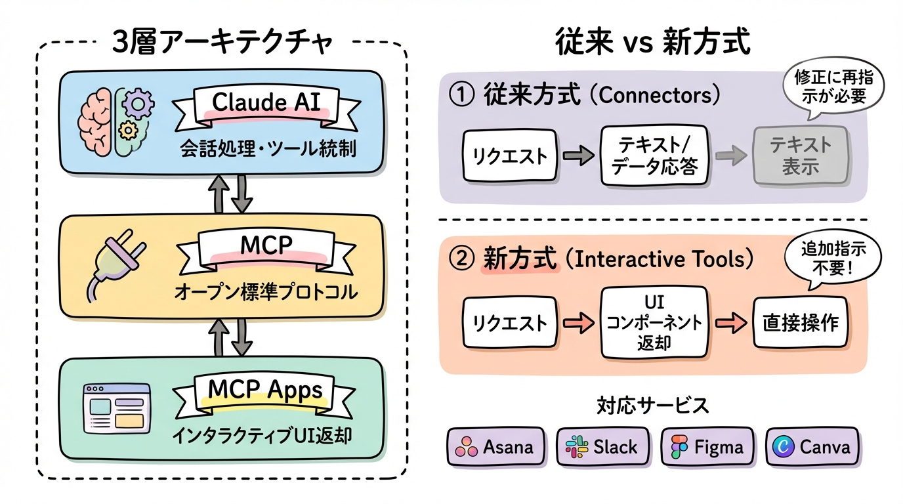
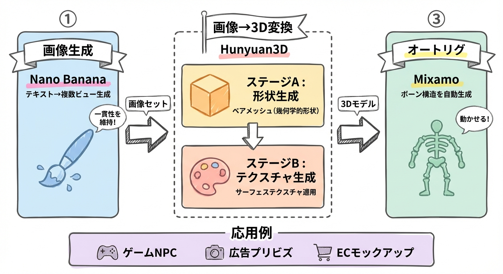
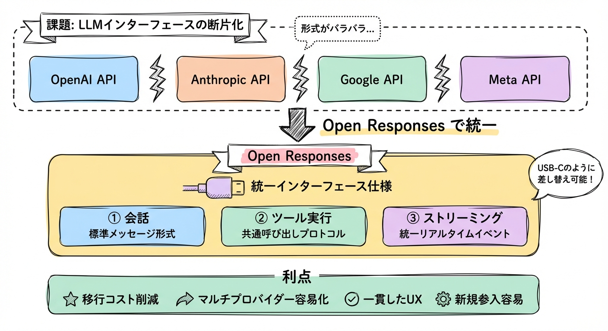

# Gallery

generate-diagram-jp で生成した図解の作例集。すべて balanced モード（特記なき場合）。

[README に戻る](../README.md)

---

## スタイルモード概要図

同じ「3モード比較」の内容を、各モードで生成した例。図の内容が同じでもスタイルによって印象が大きく変わる。

### academic モードで描いたモード概要

### balanced モードで描いたモード概要

### graphic-note モードで描いたモード概要

---

## 同一入力 × 3モード比較

同じ入力テキスト（Claude Cowork パイプラインの説明）を3モードで生成。

### academic

### balanced

### graphic-note

---

## balanced モード作例（さまざまな図種）

### パイプライン: AIエージェントパイプライン

### アーキテクチャ: Interactive Tools 3層構成

### パイプライン: 3Dキャラクター生成

### 比較: ヘルスケアAI戦略（OpenAI vs Anthropic）

### 課題→解決: Open Responses

### プラットフォーム: skills.sh

---

## パイプライン図

このスキル自体の仕組みを図解したもの。

